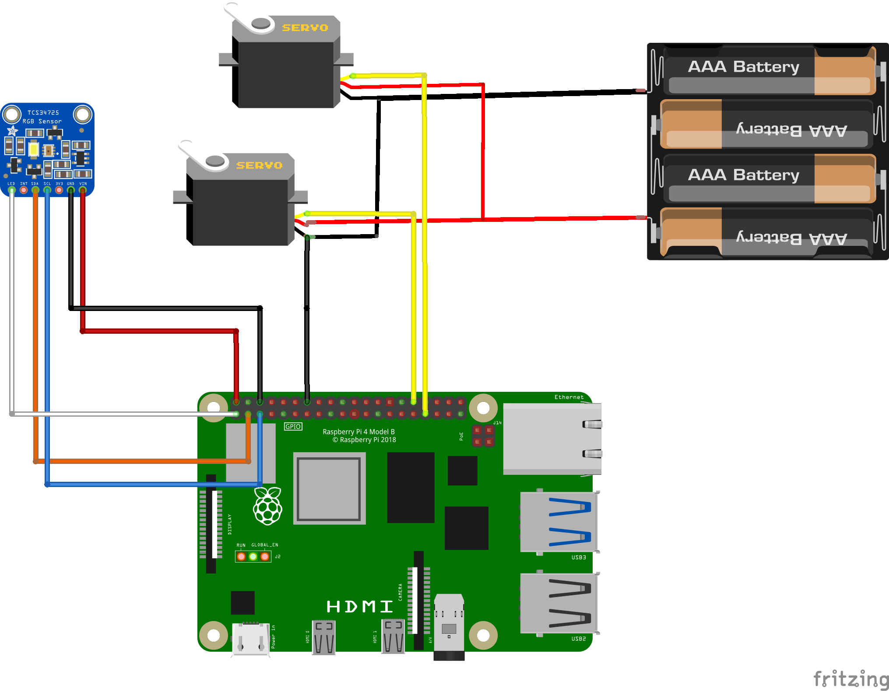

# Skittle Sorter

> ⚠️ **Preview Features & Unsupported SDK**: This project uses Azure DPS preview API (`2025-07-01-preview`) with X.509 CSR-based certificate issuance. **There is currently no official C# SDK support for these preview features.** This implementation provides direct MQTT protocol integration as a workaround. See [Device Provisioning Flow](#device-provisioning-flow) for implementation details.

This project drives a 3D printed Skittle Sorter with Azure IoT Hub integration using Azure Device Provisioning Service (DPS) with X.509 certificate-based authentication.

The hardware design is based on the [PTC Education Candy Sorter](https://github.com/PTC-Education/Candy-Sorter/) project.

## Features

- **Color Detection**: Uses TCS3472x color sensor to identify Skittle colors (Red, Green, Yellow, Purple, Orange)
- **Automated Sorting**: Servo motors position and sort Skittles into separate chutes
- **Mock Mode**: Test without physical hardware using mock sensors and servos
- **Azure DPS with X.509 Certificates** *(Preview)*: Automatic device provisioning and certificate-based authentication using Azure Device Provisioning Service preview API (`2025-07-01-preview`) with CSR-based certificate issuance
  - ⚠️ **Note**: Direct MQTT protocol implementation (C# SDK does not yet support these preview features)
- **IoT Hub Integration**: Sends detected Skittle colors with timestamps to Azure IoT Hub for real-time monitoring
- **Configuration-Driven**: All servo angles and chute positions externalized to `appsettings.json`

### Sorter in Action


## Prerequisites

- .NET 10.0 SDK
- Azure Account with:
  - IoT Hub instance
  - Device Provisioning Service (DPS) instance with enrollment group
- Hardware:
  - Raspberry Pi or compatible device
  - TCS3472x color sensor
  - 2x Servo motors
  - 3D printed sorter components

## Hardware Wiring

### Circuit Diagram



### Wiring Table

| Pi Pin | Item          | Pin |
|--------|---------------|-----|
| 1      | TCS34725      | LED |
| 2      | TCS34725      | VIN |
| 3      | TCS34725      | SDA |
| 5      | TCS34725      | SCL |
| 14     | Servo 1+2     | GND |
| 32     | Servo 1       | Pulse |
| 33     | Servo 2       | Pulse |

## Azure Setup

**Prerequisites**: Install [Azure CLI](https://learn.microsoft.com/cli/azure/install-azure-cli) and login:
```powershell
az login
az account set --subscription "Your-Subscription-Name"
```

### 1. Create Resource Group, IoT Hub, and Device Provisioning Service

```powershell
# Set variables
$resourceGroup = "skittlesorter-rg"
$location = "eastus"
$iotHubName = "skittlesorter-hub"
$dpsName = "skittlesorter-dps"

# Create resource group
az group create --name $resourceGroup --location $location

# Create IoT Hub (Standard tier required for DPS)
az iot hub create `
  --name $iotHubName `
  --resource-group $resourceGroup `
  --sku S1 `
  --location $location

# Create Device Provisioning Service
az iot dps create `
  --name $dpsName `
  --resource-group $resourceGroup `
  --location $location

# Link IoT Hub to DPS
$iotHubConnectionString = az iot hub connection-string show `
  --hub-name $iotHubName `
  --query connectionString -o tsv

az iot dps linked-hub create `
  --dps-name $dpsName `
  --resource-group $resourceGroup `
  --connection-string $iotHubConnectionString `
  --location $location

# Get DPS ID Scope (save this for appsettings.json)
az iot dps show --name $dpsName --resource-group $resourceGroup --query properties.idScope -o tsv
```

### 2. Create Azure Device Registry with Credential Policy

The certificate issuance feature requires Azure Device Registry (ADR) with a credential policy:

```powershell
$adrNamespace = "skittlesorter-adr"
$credentialPolicyName = "cert-policy"

# Create ADR namespace
az iot device-registry namespace create `
  --name $adrNamespace `
  --resource-group $resourceGroup

# Create credential policy for certificate issuance
az iot device-registry credential-policy create `
  --namespace-name $adrNamespace `
  --credential-policy-name $credentialPolicyName `
  --resource-group $resourceGroup `
  --certificate-type ECC `
  --validity-period-days 30
```

**Note**: You can use `RSA` instead of `ECC`. Adjust validity period as needed.

### 3. Create Enrollment Group with ADR Policy

```powershell
$enrollmentGroupName = "skittlesorter-group"

# Create enrollment group with symmetric key attestation
az iot dps enrollment-group create `
  --dps-name $dpsName `
  --resource-group $resourceGroup `
  --enrollment-id $enrollmentGroupName `
  --attestation-type symmetrickey `
  --credential-policy-name $credentialPolicyName `
  --credential-policy-namespace $adrNamespace

# Get the primary key (save this for appsettings.json)
az iot dps enrollment-group show `
  --dps-name $dpsName `
  --resource-group $resourceGroup `
  --enrollment-id $enrollmentGroupName `
  --query attestation.symmetricKey.primaryKey -o tsv
```

### 4. Configure Device Credentials

**⚠️ SECURITY**: Never commit `appsettings.json` to source control as it contains secrets!

1. **Copy the template**:
   ```bash
   cp appsettings.template.json appsettings.json
   ```

2. **Update `appsettings.json`** with your DPS credentials:
   - `IdScope`: From DPS Overview
   - `EnrollmentGroupKeyBase64`: The enrollment group primary key (base64-encoded)
   - `RegistrationId`: Your device's unique identifier
- `RegistrationId`: Your device identifier (e.g., `skittlesorter`)

See Configuration section below for complete settings.

## Configuration

Create an `appsettings.json` file in the project root with the following structure:

```json
{
  "MockMode": {
    "EnableMockColorSensor": true,
    "EnableMockServos": true,
    "MockColorSequence": [
      "Red",
      "Green",
      "Yellow",
      "Purple",
      "Orange"
    ]
  },
  "ServoPositions": {
    "PickAngle": 160,
    "DetectAngle": 60,
    "DropAngle": 0
  },
  "ChutePositions": {
    "Red": 22,
    "Green": 44,
    "Purple": 66,
    "Yellow": 88,
    "Orange": 112,
    "Default": 22
  },
  "IoTHub": {
    "DeviceConnectionString": "HostName=your-hub.azure-devices.net;DeviceId=your-device;SharedAccessKey=***",
    "DeviceId": "skittlesorter",
    "SendTelemetry": true,
    "DpsProvisioning": {
      "IdScope": "0ne01104302",
      "RegistrationId": "skittlesorter",
      "ProvisioningHost": "global.azure-devices-provisioning.net",
      "EnrollmentGroupKeyBase64": "your-enrollment-group-primary-key-base64-encoded",
      "DeviceKeyBase64": null,
      "CertificatePath": "certs/device.csr",
      "PrivateKeyPath": "certs/device.key",
      "IssuedCertificatePath": "certs/issued.pem",
      "ApiVersion": "2025-07-01-preview",
      "SasExpirySeconds": 3600,
      "AutoGenerateCsr": true,
      "MqttPort": 8883
    }
  }
}
```

### Configuration Options

#### MockMode

**When to use Mock Mode:**
- **On a regular PC/laptop**: Set both `EnableMockColorSensor` and `EnableMockServos` to `true`. Standard computers don't have GPIO pins or I2C interfaces required for physical sensors and servos.
- **On a Raspberry Pi with hardware**: Set both to `false` to use the actual TCS3472x color sensor and servo motors connected via GPIO.

Options:
- `EnableMockColorSensor`: Set to `true` to use simulated color readings
- `EnableMockServos`: Set to `true` to simulate servo movements
- `MockColorSequence`: Array of colors to cycle through in mock mode

#### ServoPositions

Configure servo motor angles for picker and sorter movements:
- `PickAngle`: Angle to pick up a Skittle (default: 160°)
- `DetectAngle`: Angle to position in color detection area (default: 60°)
- `DropAngle`: Angle to drop Skittle into chute (default: 0°)

#### ChutePositions

Configure servo angle for each color chute:
- `Red`, `Green`, `Purple`, `Yellow`, `Orange`: Servo angles for each color's chute
- `Default`: Fallback angle for unknown colors

#### IoTHub

**Standard Connection (without DPS):**
- `DeviceConnectionString`: Your Azure IoT Hub device connection string
- `DeviceId`: Your device identifier
- `SendTelemetry`: Enable/disable telemetry sending

**DPS Provisioning Configuration:**
- `IdScope`: Your DPS ID Scope
- `RegistrationId`: Device registration ID (e.g., `skittlesorter`)
- `ProvisioningHost`: DPS endpoint (usually `global.azure-devices-provisioning.net`)
- `EnrollmentGroupKeyBase64`: Base64-encoded enrollment group primary key
- `DeviceKeyBase64`: Pre-computed device key (optional; auto-derived if null)
- `CertificatePath`: Path to CSR file
- `PrivateKeyPath`: Path to private key file
- `IssuedCertificatePath`: Path to store the issued X.509 certificate
- `ApiVersion`: DPS API version (use `2025-07-01-preview` for CSR-based provisioning)
- `SasExpirySeconds`: SAS token TTL in seconds (default: 3600)
- `AutoGenerateCsr`: Auto-generate CSR and private key if files don't exist (default: true)
- `MqttPort`: MQTT port for DPS connection (default: 8883)
- `EnableDebugLogging`: Enable verbose MQTT protocol logging for troubleshooting (default: false)

**Debugging DPS Connection Issues:**
Set `EnableDebugLogging: true` to see detailed MQTT protocol messages including:
- Connection parameters and credentials (lengths only, not actual keys)
- Message topics and payload sizes
- Response parsing and polling attempts
- Status updates during provisioning

Leave it `false` for cleaner production output.

## Running the Application

```bash
dotnet restore
dotnet build
dotnet run
```

The application will:
1. Load configuration from `appsettings.json`
2. Initialize hardware (or mock mode)
3. Provision device with Azure DPS (auto-generates and issues X.509 certificate)
4. Connect to Azure IoT Hub using certificate authentication
5. Begin the sorting loop:
   - Pick up a Skittle
   - Read its color
   - Send telemetry to IoT Hub (detected colors only)
   - Position the chute based on color
   - Drop the Skittle
   - Repeat

## Architecture

The solution is organized into two projects:

### AzureDpsFramework

A reusable class library implementing Azure Device Provisioning Service with X.509 certificate support. **[📖 Full Documentation](AzureDpsFramework/README.md)**

**Why a Custom MQTT Implementation?**

The official `Microsoft.Azure.Devices.Provisioning.Client` NuGet package does not yet support:
- The `2025-07-01-preview` DPS API version
- CSR-based X.509 provisioning (only supports pre-generated certificates or symmetric keys)
- The new Azure Device Registry (ADR) certificate issuance workflow

**Solution**: This library provides a **direct MQTT protocol implementation** (using MQTTnet) that communicates directly with the DPS MQTT endpoint, bypassing the SDK limitations. All DPS MQTT protocol specifications are implemented manually, enabling full support for preview features.

**Key Features**:
- ✅ Symmetric key authentication with device key derivation
- ✅ Automatic CSR generation (RSA or ECC)
- ✅ MQTT protocol implementation for DPS (port 8883 TLS)
- ✅ Certificate issuance via Azure Device Registry credential policies
- ✅ SAS token generation with proper URL encoding
- ✅ Polling support for async device assignment
- ✅ X.509 certificate loading with private key persistence

**Components**:

- **DpsConfiguration**: Loads and validates DPS settings from `appsettings.json`
- **DpsSasTokenGenerator**: Generates DPS-compatible SAS tokens with symmetric key derivation
- **CertificateManager**: Handles CSR generation, PEM persistence, and X.509 certificate loading
- **DpsProvisioningClient**: Orchestrates MQTT-based device registration flow

> **Implementation Note**: Since the official Microsoft.Azure.Devices.Provisioning.Client SDK does not yet support the preview DPS features (CSR-based X.509 provisioning via `2025-07-01-preview` API), this library provides a direct MQTT protocol implementation using MQTTnet. All communication follows the DPS MQTT protocol specification.
> 
> For detailed information about the authentication flow, MQTT protocol details, troubleshooting, and API reference, see **[AzureDpsFramework/README.md](AzureDpsFramework/README.md)**.

### skittlesorter (Application)

Main application implementing the sorting logic:

- **ConfigurationLoader**: Loads all configuration from `appsettings.json` (mock mode, IoT Hub, DPS, servo positions, chute positions)
- **ServoController**: Manages servo positioning with configuration-driven angle mappings
- **TelemetryService**: Sends detected Skittle colors to IoT Hub
- **DpsInitializationService**: Orchestrates DPS provisioning and returns authenticated `DeviceClient`
- **SkittleSorterService**: Main sorting loop orchestration (color detection → servo movement → telemetry)
- **Program.cs**: Entry point loading all configurations and running the application

## Device Provisioning Flow

When the application starts with DPS enabled:

1. **Load DPS Configuration**: Read from `appsettings.json`
2. **Generate CSR (if needed)**: Auto-create device certificate signing request and private key (RSA 2048 by default)
3. **Derive Device Key**: Compute device-specific key using `HMACSHA256(base64Decode(enrollmentGroupKey), lowercase(registrationId))`
4. **Generate SAS Token**: Create signed MQTT credentials with DPS endpoint and URL-encoded resource URI
5. **MQTT Connection**: Connect to `global.azure-devices-provisioning.net:8883` with TLS
6. **MQTT Registration**: Publish registration request with base64-encoded DER CSR to `$dps/registrations/PUT/iotdps-register/`
7. **Poll for Status**: Wait for DPS to process (status: "assigning") and poll every 2 seconds via `$dps/registrations/GET/iotdps-get-operationstatus/`
8. **Receive Certificate**: Get assigned IoT Hub, device ID, and issued X.509 certificate chain (3 certificates: device + intermediate + root)
9. **Parse Certificate**: Convert base64 certificates to PEM format, combine device cert with private key, export to PFX and reload (fixes ephemeral key issue)
10. **Connect to IoT Hub**: Authenticate using X.509 certificate-based connection (not symmetric key)
11. **Begin Sorting**: Start main application loop with certificate authentication

**Authentication Summary**:
- **Phase 1 (DPS)**: Symmetric key authentication (derived from enrollment group key)
- **Phase 2 (IoT Hub)**: X.509 certificate authentication (issued by DPS via Azure Device Registry)

**Key Insight**: The symmetric key is ONLY used to authenticate with DPS. Once the certificate is issued, all subsequent IoT Hub communication uses X.509 certificate authentication.

For detailed protocol specifications, see **[AzureDpsFramework/README.md](AzureDpsFramework/README.md)#how-it-works**.

## Telemetry Format

Each detected Skittle sends a message to IoT Hub with the following structure:

```json
{
  "messageId": 1,
  "deviceId": "skittlesorter",
  "color": "Red",
  "timestamp": "2026-01-17T10:30:45.123Z",
  "detectionTime": "2026-01-17 10:30:45.123"
}
```

Message properties include:
- `colorAlert`: Set to "detected" for all valid Skittle colors

## Development

### Testing Without Hardware (Mock Mode)

Perfect for development and testing on a regular PC where physical hardware isn't available:

1. Set both `EnableMockColorSensor` and `EnableMockServos` to `true` in `appsettings.json`
2. Customize the `MockColorSequence` to test different color patterns
3. The application will simulate the full sorting process, cycling through the specified colors
4. All IoT Hub telemetry will still be sent (if enabled), allowing you to test the cloud integration and DPS provisioning

### Running on Raspberry Pi with Hardware

When running on a Raspberry Pi with the physical sorter assembled:

1. Set both `EnableMockColorSensor` and `EnableMockServos` to `false`
2. Ensure your TCS3472x sensor is connected via I2C
3. Ensure your servo motors are connected to the appropriate GPIO pins
4. The application will use real hardware for color detection and sorting
5. Device provisioning and certificate authentication will work seamlessly with DPS

### Troubleshooting DPS Issues

Common issues with DPS provisioning:

**401 Unauthorized**:
- Wrong enrollment group key → Verify key matches DPS portal
- Registration ID mismatch → Check exact spelling (case-sensitive)
- Check diagnostic logs: `[KEY DERIVATION]` and `[SAS]`

**400 Bad Request**:
- CSR format incorrect → Must be base64 DER (not PEM with headers)
- API version mismatch → Ensure using `2025-07-01-preview`
- Enrollment group not linked to ADR policy

**Certificate Not Issued**:
- Credential policy not configured
- ADR namespace issues
- Check Azure Portal DPS logs

**TLS Authentication Error**:
- Certificate not properly persisted
- Library handles this automatically with PFX export/reload

For detailed troubleshooting steps, see **[AzureDpsFramework/README.md](AzureDpsFramework/README.md)#troubleshooting**.

## Security Best Practices

**⚠️ Important**: This repository excludes sensitive files via `.gitignore`:

**Never commit these files:**
- `appsettings.json` - Contains DPS enrollment keys and secrets
- `certs/` directory - Contains private keys and certificates
- `*.pem`, `*.key`, `*.pfx` files - Certificate and private key files

**Safe to commit:**
- `appsettings.template.json` - Template configuration (no secrets)
- Source code files
- Documentation

**Setup for new developers:**
1. Copy `appsettings.template.json` to `appsettings.json`
2. Fill in actual values from Azure Portal
3. Run the application - certificates are auto-generated on first run

### Customizing Servo and Chute Angles

All servo angles are externalized in `appsettings.json`. No recompilation needed to adjust positions:

- Modify `ServoPositions` to change pick/detect/drop angles
- Modify `ChutePositions` to change angle mappings for each color
- Restart the application to apply changes

### Building for Raspberry Pi from Windows

```bash
# Cross-compile to Linux ARM64 (Raspberry Pi 4/5)
dotnet publish -c Release -r linux-arm64 --self-contained
```

Then transfer the published output to your Raspberry Pi and run.

## Security Considerations

- **DPS Credentials**: Store your enrollment group key securely. Never commit `appsettings.json` with real credentials to version control.
  - ✅ Use Azure Key Vault for production
  - ✅ Use environment variables or secure configuration
  - ❌ Never hardcode or commit to Git
- **Certificates**: Device certificates are auto-generated and stored locally. Protect the `certs/` directory.
  - ✅ Use restrictive file permissions (chmod 600 on Linux)
  - ✅ Consider hardware security modules (HSM) for production
  - ✅ Rotate certificates before expiry (check validity period)
- **Connection Strings**: If using direct IoT Hub connection (without DPS), keep connection strings in environment variables or Azure Key Vault, never in code.
- **MQTT Port 8883**: Requires TLS/SSL. DPS endpoint is `global.azure-devices-provisioning.net:8883`.
- **Private Keys**: The private key (`certs/device.key`) must be protected. It is used to prove certificate ownership.

For detailed security guidance, see **[AzureDpsFramework/README.md](AzureDpsFramework/README.md)#security-considerations**.

## License

**Code**: MIT License (see LICENSE file)

**Hardware/3D Models**: Licensed under the same terms as the original [Candy Sorter repository](https://github.com/PTC-Education/Candy-Sorter/) (PTC Education)

You are free to use, modify, and distribute the code in this repository under the MIT License. The 3D printed sorter components are based on PTC Education's Candy Sorter design.
