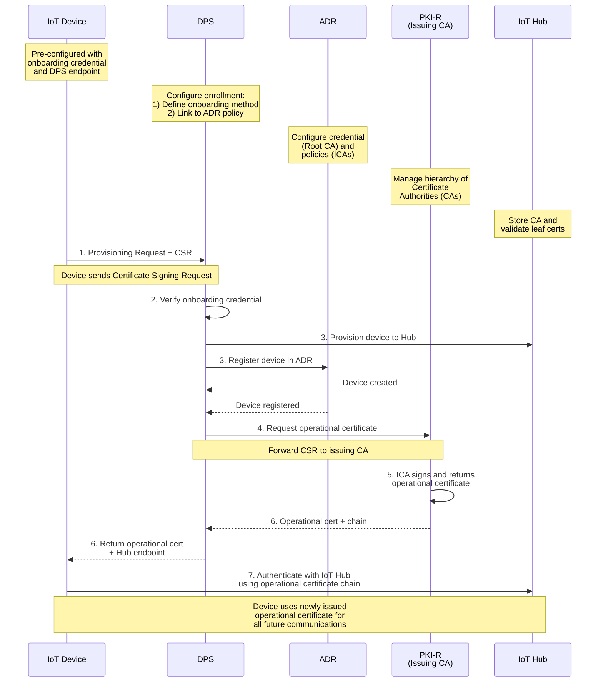

# Understanding X.509 and CSR Workflows

[← Previous: Creating Azure Resources](02-creating-azure-resources.md) | [Next: Configuring Enrollment Groups →](04-configuring-enrollment-groups.md)

---

This series uses Microsoft's **new** certificate management (preview) that enables devices to receive X.509 certificates automatically during provisioning. This post provides a high-level overview and points you to resources for implementation.

> **🆕 Preview Feature:** Microsoft-backed X.509 certificate management was announced in November 2025 and is currently in public preview. **Not recommended for production workloads.** For details, see [Certificate Management Overview](https://learn.microsoft.com/en-us/azure/iot-hub/iot-hub-certificate-management-overview)

---

## Two Types of Certificates

The new certificate management service makes use of a **two-phase approach**:

### Phase 1: Onboarding Credentials
- **Purpose:** Device authenticates to DPS during initial provisioning
- **Options:** X.509 certificates (from third-party CA), symmetric keys, or TPM
- **Your responsibility:** Pre-install on device before shipment
- **Lifespan:** Long-lived or used once for initial authentication

### Phase 2: Operational Certificates (Microsoft-Managed)
- **Purpose:** Device authenticates to IoT Hub for ongoing operations
- **How it works:** Automatically issued by ADR during provisioning via CSR
- **Generated on:** Device itself (private key never leaves device)
- **Lifespan:** Short-lived (1-90 days), automatically renewed
- **Security:** Higher security, no key transport

## How It Works

The following diagram shows the complete provisioning flow:



**Key Steps:**
1. **Device sends provisioning request + CSR** - Device authenticates with onboarding credential and submits Certificate Signing Request
2. **DPS verifies onboarding credential** - Validates device identity (X.509, symmetric key, or TPM)
3. **Device provisioned to Hub and registered in ADR** - Device identity created in both services
4. **Request operational certificate** - DPS forwards CSR to ADR issuing CA (policy)
5. **ICA signs and returns operational certificate** - ADR issuing CA issues leaf certificate
6. **Return operational cert + Hub endpoint** - DPS sends certificate chain back to device
7. **Device authenticates with IoT Hub** - Device uses new operational certificate for all future connections

## Microsoft-Managed PKI Architecture

Azure Device Registry (ADR) manages a dedicated PKI for your namespace:

- **Root CA (Credential):** One unique root CA per ADR namespace, managed by Microsoft using Azure Managed HSM
- **Issuing CA (Policy):** One issuing CA per policy, defines certificate validity (1-90 days)
- **Leaf Certificate (Operational):** End-entity certificate issued to device by issuing CA

The issuing CA certificates are automatically synced from ADR to all linked IoT Hubs, enabling Hub to authenticate devices.

## Key Features

| Feature | Description |
|---------|-------------|
| **Algorithms** | ECC (ECDSA) with NIST P-384 curve, SHA-384 hashing |
| **HSM Keys** | Azure Managed HSM (no additional subscription required) |
| **Certificate Validity** | 1-90 days (configurable per policy) |
| **Protocols** | HTTP and MQTT during provisioning |
| **Renewal** | Device-initiated via DPS registration call |
| **CA Sync** | Automatic sync from ADR to linked IoT Hubs |

## What You Need to Do

For this series, you'll create **onboarding credentials** (Phase 1) - we provide automation scripts:

> **Preview Reminder:** Microsoft-backed X.509 certificate management is **new and in public preview**. Operational certificates (Phase 2) are issued by ADR during provisioning and are **not recommended for production workloads** during preview.

### Quick Setup: Automated X.509 Bootstrap Certificates (if you didn't already run the full setup script!)

```powershell
cd scripts

.\setup-x509-attestation.ps1 `
  -RegistrationId "my-device" `
  -DpsName "my-dps-001" `
  -ResourceGroup "my-iot-rg" `
  -EnrollmentGroupId "my-device-group"
```

### Manual Setup: Step-by-Step (X.509 Bootstrap Certificates)

If you prefer not to use the script, here are the manual steps to create **onboarding credentials** (bootstrap certs) and verify your CA with DPS.

> **Preview Reminder:** The **operational** certificate issuance that happens after these steps is **new and in preview**. Your device will receive those certificates only during provisioning via DPS/ADR.

**Prerequisites:**

```powershell
# Verify tools are available
az --version                    # Azure CLI
openssl version                 # OpenSSL
```

If PowerShell shows this error when you run `openssl`:

```
openssl : The term 'openssl' is not recognized as the name of a cmdlet, function, script file, or operable program.
```

Add OpenSSL to your PATH for this session (check if if this is the correct path for your openssl install):

```powershell
$env:Path = "C:\Program Files\OpenSSL-Win64\bin;$env:Path"
```

**1) Set variables and create folders:**

**Set variables:**

```powershell
$resourceGroup = "my-iot-rg"
$dpsName = "my-dps-001"
$registrationId = "my-device"
$enrollmentGroupId = "my-device-group"
$certDir = ".\certs"
```

**Create root CA folder:**

```powershell
New-Item -ItemType Directory -Path "$certDir\root" -Force | Out-Null
```

**Create intermediate CA folder:**

```powershell
New-Item -ItemType Directory -Path "$certDir\ca" -Force | Out-Null
```

**Create device folder:**

```powershell
New-Item -ItemType Directory -Path "$certDir\device" -Force | Out-Null
```

**2) Create root and intermediate CA:**

**Create root CA certificate (self-signed):**

```powershell
openssl req -x509 -new -nodes -newkey rsa:4096 -keyout "$certDir\root\root-ca.key" -out "$certDir\root\root-ca.pem" -days 3650 -sha256 `
  -subj "/CN=$registrationId-root" `
  -addext "basicConstraints=critical,CA:true,pathlen:1" `
  -addext "keyUsage=critical,keyCertSign,cRLSign" `
  -addext "subjectKeyIdentifier=hash" `
  -addext "authorityKeyIdentifier=keyid:always"
```

**Create intermediate CA private key:**

```powershell
openssl genrsa -out "$certDir\ca\intermediate-ca.key" 4096
```

**Create intermediate CA CSR:**

```powershell
openssl req -new `
  -key "$certDir\ca\intermediate-ca.key" `
  -out "$certDir\ca\intermediate-ca.csr" `
  -subj "/CN=$registrationId-intermediate"
```

**Create intermediate CA extensions file:**

```powershell
@"
[ v3_intermediate ]
basicConstraints = critical,CA:true,pathlen:0
keyUsage = critical, keyCertSign, cRLSign
subjectKeyIdentifier = hash
authorityKeyIdentifier = keyid:always,issuer
"@ | Set-Content -Path "$certDir\ca\intermediate-ext.cnf" -Encoding ASCII
```

**Sign intermediate CA with root CA:**

```powershell
openssl x509 -req `
  -in "$certDir\ca\intermediate-ca.csr" `
  -CA "$certDir\root\root-ca.pem" `
  -CAkey "$certDir\root\root-ca.key" `
  -CAcreateserial `
  -out "$certDir\ca\intermediate-ca.pem" `
  -days 1825 -sha256 `
  -extfile "$certDir\ca\intermediate-ext.cnf" -extensions v3_intermediate
```

**3) Extract certificate thumbprints:**

**Extract root CA thumbprint:**

```powershell
$rootX509 = New-Object System.Security.Cryptography.X509Certificates.X509Certificate2("$certDir\root\root-ca.pem")
$rootThumbprint = $rootX509.Thumbprint
Write-Host "Root Thumbprint: $rootThumbprint" -ForegroundColor Green
```

**Extract intermediate CA thumbprint:**

```powershell
$caX509 = New-Object System.Security.Cryptography.X509Certificates.X509Certificate2("$certDir\ca\intermediate-ca.pem")
$caThumbprint = $caX509.Thumbprint
Write-Host "Intermediate Thumbprint: $caThumbprint" -ForegroundColor Green
```

**4) Upload and verify root CA with DPS:**

**Upload root CA to DPS:**

```powershell
$rootCertName = "$registrationId-root"
az iot dps certificate create --dps-name $dpsName --resource-group $resourceGroup --certificate-name $rootCertName --path "$certDir\root\root-ca.pem"
```

**Get root CA etag and generate verification code:**

```powershell
$rootCert = az iot dps certificate show --dps-name $dpsName --resource-group $resourceGroup --certificate-name $rootCertName -o json | ConvertFrom-Json
$rootEtag = $rootCert.properties.etag

$rootVer = az iot dps certificate generate-verification-code --dps-name $dpsName --resource-group $resourceGroup --certificate-name $rootCertName --etag $rootEtag -o json | ConvertFrom-Json
$rootVerCode = $rootVer.properties.verificationCode
Write-Host "Verification Code: $rootVerCode" -ForegroundColor Cyan
```

**Create root CA verification certificate:**

```powershell
openssl genrsa -out "$certDir\root\verification.key" 2048
openssl req -new -key "$certDir\root\verification.key" -out "$certDir\root\verification.csr" -subj "/CN=$rootVerCode"
openssl x509 -req -in "$certDir\root\verification.csr" -CA "$certDir\root\root-ca.pem" -CAkey "$certDir\root\root-ca.key" -CAcreateserial -out "$certDir\root\verification.pem" -days 1 -sha256
```

**Verify root CA in DPS:**

```powershell
$rootEtag = $rootVer.properties.etag
az iot dps certificate verify --dps-name $dpsName --resource-group $resourceGroup --certificate-name $rootCertName --path "$certDir\root\verification.pem" --etag $rootEtag
Write-Host "✓ Root CA verified in DPS" -ForegroundColor Green
```

**5) Upload and verify intermediate CA with DPS:**

**Upload intermediate CA to DPS:**

```powershell
$caCertName = "$registrationId-intermediate"
az iot dps certificate create --dps-name $dpsName --resource-group $resourceGroup --certificate-name $caCertName --path "$certDir\ca\intermediate-ca.pem"
```

**Get intermediate CA etag and generate verification code:**

```powershell
$caCert = az iot dps certificate show --dps-name $dpsName --resource-group $resourceGroup --certificate-name $caCertName -o json | ConvertFrom-Json
$caEtag = $caCert.properties.etag

$caVer = az iot dps certificate generate-verification-code --dps-name $dpsName --resource-group $resourceGroup --certificate-name $caCertName --etag $caEtag -o json | ConvertFrom-Json
$caVerCode = $caVer.properties.verificationCode
Write-Host "Verification Code: $caVerCode" -ForegroundColor Cyan
```

**Create intermediate CA verification certificate:**

```powershell
openssl genrsa -out "$certDir\ca\verification.key" 2048
openssl req -new -key "$certDir\ca\verification.key" -out "$certDir\ca\verification.csr" -subj "/CN=$caVerCode"
openssl x509 -req -in "$certDir\ca\verification.csr" -CA "$certDir\ca\intermediate-ca.pem" -CAkey "$certDir\ca\intermediate-ca.key" -CAcreateserial -out "$certDir\ca\verification.pem" -days 1 -sha256
```

**Verify intermediate CA in DPS:**

```powershell
$caEtag = $caVer.properties.etag
az iot dps certificate verify --dps-name $dpsName --resource-group $resourceGroup --certificate-name $caCertName --path "$certDir\ca\verification.pem" --etag $caEtag
Write-Host "✓ Intermediate CA verified in DPS" -ForegroundColor Green
```

**6) Create device bootstrap certificate:**

**Create device private key and CSR:**

```powershell
openssl genrsa -out "$certDir\device\device.key" 2048
openssl req -new -key "$certDir\device\device.key" -out "$certDir\device\device.csr" -subj "/CN=$registrationId"
```

**Create device extensions file:**

```powershell
@"
[ v3_req ]
basicConstraints = CA:FALSE
keyUsage = critical, digitalSignature, keyEncipherment
extendedKeyUsage = clientAuth
subjectAltName = DNS:$registrationId
authorityKeyIdentifier = keyid:always,issuer
"@ | Set-Content -Path "$certDir\device\device-ext.cnf" -Encoding ASCII
```

**Sign device certificate with intermediate CA:**

```powershell
openssl x509 -req -in "$certDir\device\device.csr" -CA "$certDir\ca\intermediate-ca.pem" -CAkey "$certDir\ca\intermediate-ca.key" -out "$certDir\device\device.pem" -days 365 -sha256 -extfile "$certDir\device\device-ext.cnf" -extensions v3_req
```

**Create certificate chain files:**

```powershell
Get-Content "$certDir\ca\intermediate-ca.pem", "$certDir\root\root-ca.pem" | Set-Content -Path "$certDir\device\chain.pem" -Encoding ASCII
Get-Content "$certDir\device\device.pem", "$certDir\ca\intermediate-ca.pem", "$certDir\root\root-ca.pem" | Set-Content -Path "$certDir\device\device-full-chain.pem" -Encoding ASCII
Write-Host "✓ Device bootstrap certificate created" -ForegroundColor Green
```

**7) Create DPS enrollment group:**

```powershell
az iot dps enrollment-group create --dps-name $dpsName --resource-group $resourceGroup --enrollment-id $enrollmentGroupId --ca-name "$registrationId-intermediate" --credential-policy "default" --provisioning-status enabled

Write-Host "✓ Enrollment group created with CSR-based certificate issuance" -ForegroundColor Green
```

**8) Deploy to device:**

Copy to your device:
- `$certDir\device\device.pem` - Bootstrap certificate
- `$certDir\device\device.key` - Device private key
- `$certDir\device\device-full-chain.pem` - Full certificate chain

Store keys securely (TPM/secure element if available).

## Setup Complete

You've now completed all manual setup steps:

**✓ Certificate Authority Chain Created:**
- Root CA (uploaded and verified in DPS)
- Intermediate CA (uploaded and verified in DPS)
- Device bootstrap certificate (signed by intermediate CA)

**✓ DPS Enrollment Configured:**
- Enrollment group linked to intermediate CA
- CSR-based certificate issuance enabled
- Ready for device provisioning

**Certificate Files Created:**
- Root: `$certDir\root\root-ca.pem`
- Intermediate: `$certDir\ca\intermediate-ca.pem`
- Device: `$certDir\device\device.pem`
- Device Key: `$certDir\device\device.key`
- TLS Chain: `$certDir\device\chain.pem` (intermediate + root)
- Full Chain: `$certDir\device\device-full-chain.pem` (leaf + intermediate + root)

**What Happens Next:**
1. Deploy `device.pem`, `device.key`, and `device-full-chain.pem` to your device
2. Device boots and authenticates to DPS with bootstrap certificate
3. Device generates new key pair and submits Certificate Signing Request (CSR)
4. DPS forwards CSR to ADR issuing CA (via credential policy)
5. ADR issues operational certificate (Phase 2)
6. Device receives operational certificate from DPS
7. Device uses operational certificate for all IoT Hub connections

**For Detailed Explanations:**
See [Understanding X.509 and CSR Workflows (Deep Dive)](03a-x509-and-csr-workflows-deep-dive.md) for complete technical details, certificate architecture, and advanced scenarios.

## Certificate Renewal

Devices are responsible for monitoring operational certificate expiration:

- Check `Valid until` date periodically
- Initiate renewal before expiration (recommended: 7 days before)
- Generate new CSR and submit to DPS (same as initial provisioning)
- Receive renewed certificate from ADR

**Best Practice:** Use Device Twin reported properties to track certificate issuance/expiration dates for monitoring.

## Preview Limitations

⚠️ **Certificate Revocation:** Not supported in preview - disable device in IoT Hub instead
⚠️ **Production Use:** Not recommended during preview
⚠️ **SDK Support:** Official Microsoft SDKs don't yet support `2025-07-01-preview` API

## Learn More

**Official Microsoft Documentation:**
- [What's New in IoT Hub](https://learn.microsoft.com/en-us/azure/iot-hub/iot-hub-what-is-new)
- [Certificate Management Overview](https://learn.microsoft.com/en-us/azure/iot-hub/iot-hub-certificate-management-overview)
- [Certificate Management Concepts](https://learn.microsoft.com/en-us/azure/iot-hub/iot-hub-certificate-management-concepts)

**Deep Dive:**
- [Understanding X.509 and CSR Workflows (Deep Dive)](03a-x509-and-csr-workflows-deep-dive.md) - Detailed technical explanation with manual steps

## Next Steps

Now that you understand the certificate workflow, you'll configure enrollment groups to use these certificates:

- Creating X.509 enrollment groups
- Linking ADR policies for operational certificate issuance
- Testing provisioning with certificates

---

[Next: Configuring Enrollment Groups →](04-configuring-enrollment-groups.md)
