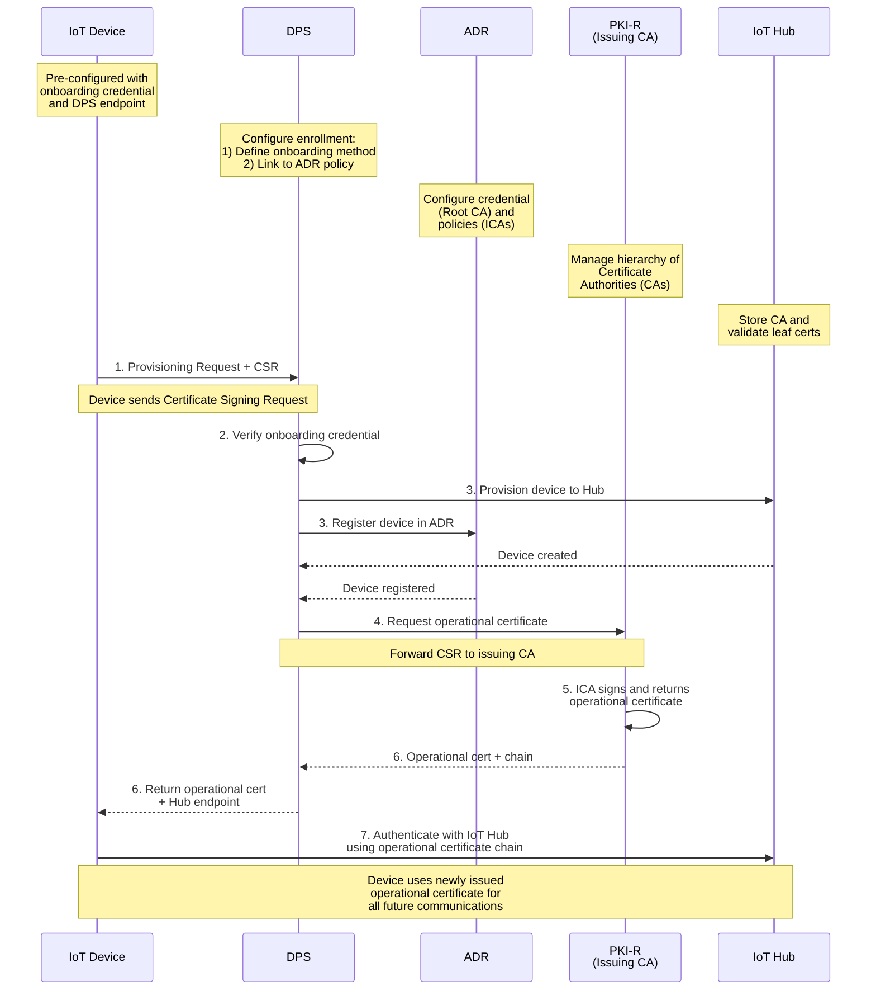

# Understanding X.509 and CSR Workflows

[← Previous: Creating Azure Resources](02-creating-azure-resources.md) | [Next: Configuring Enrollment Groups →](04-configuring-enrollment-groups.md)

---

In this post, we'll explore the differences between traditional X.509 certificate management and the **new Certificate Signing Request (CSR) workflow** introduced in the `2025-07-01-preview` API. Understanding both approaches will help you choose the right strategy for your IoT deployment.

> **🆕 Preview Feature:** The CSR-based certificate issuance with Microsoft-managed CA is currently in preview (announced November 2025). This feature enables devices to generate their own keys and receive signed certificates from Azure Device Registry during provisioning.

---

## Quick Setup

### Using the Automation Scripts

We provide helper scripts to automate certificate generation and DPS setup:

#### Automated Full Setup (ADR + X.509)

```powershell
cd scripts

.\setup-x509-dps-adr.ps1 `
  -ResourceGroup "my-iot-rg" `
  -Location "eastus" `
  -IoTHubName "my-iothub-001" `
  -DPSName "my-dps-001" `
  -AdrNamespace "my-adrnamespace-001" `
  -UserIdentity "my-uami" `
  -RegistrationId "my-device" `
  -EnrollmentGroupId "my-device-group" `
  -AttestationType "X509"
```

This generates:
- Root CA (3650 days, pathlen:1)
- Intermediate CA (1825 days, pathlen:0)
- Device bootstrap certificate (365 days)
- Certificate verification in DPS
- Enrollment group with credential policy

#### Automated X.509 Only Setup

```powershell
cd scripts

.\setup-x509-attestation.ps1 `
  -RegistrationId "my-device" `
  -DpsName "my-dps-001" `
  -ResourceGroup "my-iot-rg" `
  -EnrollmentGroupId "my-device-group"
```

Generates just X.509 certificates and performs DPS verification.

---

## What Are X.509 Certificates?

X.509 certificates are digital documents that bind a public key to an identity. Think of them like digital passports:

- **Subject:** Who the certificate belongs to (device ID)
- **Issuer:** Who signed/issued the certificate (Certificate Authority)
- **Public Key:** Used to encrypt data or verify signatures
- **Private Key:** Kept secret, used to decrypt or sign
- **Validity Period:** Start and end dates

## X.509 Bootstrap Certificates for DPS Attestation

To use X.509 authentication with DPS, you need to create and upload a **bootstrap certificate chain** that devices will use to authenticate with DPS during provisioning.

**Important:** These bootstrap certificates are used **only for DPS authentication**. The certificates devices use to connect to IoT Hub are issued by ADR via the **new CSR-based workflow** (preview feature).

```
┌────────────────┐
│  Your Host     │  Generate Root & Intermediate CA
│  Machine       │  (create your certificate chain)
└────────┬───────┘
         │
         ▼
┌─────────────────────────────────────┐
│  Upload Root/Intermediate to DPS    │
│  (proof of possession)              │
└────────┬────────────────────────────┘
         │
         ▼
┌─────────────────────────────────────┐
│  Create Bootstrap Device Certs      │
│  (signed by Root CA)                │
│  (for DPS auth only)                │
└────────┬────────────────────────────┘
         │
         ▼
┌─────────────────────────────────────┐
│  Deploy Bootstrap Certs to Devices  │
│  (for DPS provisioning)             │
└─────────────────────────────────────┘
         │
         ▼
┌─────────────────────────────────────┐
│  During Provisioning:               │
│  Device authenticates to DPS        │
│  Device submits CSR                 │
│  ADR issues operational cert        │
└─────────────────────────────────────┘
```

You can either use the automation scripts from "Quick Setup" or follow these manual steps.

---

## Manual Step-by-Step: Create Bootstrap Certificates

### Prerequisites

```powershell
# Verify tools are available
az --version                    # Azure CLI
openssl version                 # OpenSSL
```

### Setup Variables

Before starting, define your environment:

```powershell
$resourceGroup = "my-iot-rg"
$location = "eastus"
$dpsName = "my-dps-001"
$iotHubName = "my-iothub-001"
$adrNamespace = "my-adrnamespace-001"
$userIdentity = "my-uami"
$registrationId = "my-device"
$enrollmentGroupId = "my-device-group"
$credentialPolicyName = "cert-policy"

# Create directory structure for certificates
$certDir = ".\certs"
New-Item -ItemType Directory -Path "$certDir\root" -Force | Out-Null
New-Item -ItemType Directory -Path "$certDir\ca" -Force | Out-Null
New-Item -ItemType Directory -Path "$certDir\device" -Force | Out-Null
New-Item -ItemType Directory -Path "$certDir\issued" -Force | Out-Null
```

### Step 1: Create Your Own Certificate Authority

Now we stand up a root and intermediate CA so DPS can trust a chain you control.

**Create root CA private key:**

Generates the private key for your root Certificate Authority. Keep this secure—it will sign your intermediate CA.

```powershell
openssl genrsa -out "$certDir\root\root-ca.key" 4096
```

**Create root CA certificate:**

Generates the root CA certificate (self-signed) that will be the trust anchor for your entire chain.

```powershell
openssl req -x509 -new -nodes `
  -key "$certDir\root\root-ca.key" `
  -sha256 -days 3650 `
  -out "$certDir\root\root-ca.pem" `
  -subj "/CN=$registrationId-root" `
  -addext "basicConstraints=critical,CA:true,pathlen:1" `
  -addext "keyUsage=critical,keyCertSign,cRLSign"

Write-Host "✓ Root CA created: $certDir\root\root-ca.pem" -ForegroundColor Green
```

**Create intermediate CA private key:**

Generates the private key for your intermediate CA. You'll use this to sign device certificates and the verification code.

```powershell
openssl genrsa -out "$certDir\ca\intermediate-ca.key" 4096
```

**Create intermediate CA CSR:**

Generates a Certificate Signing Request for the intermediate CA. The root CA will sign this CSR to create the intermediate certificate.

```powershell
openssl req -new `
  -key "$certDir\ca\intermediate-ca.key" `
  -out "$certDir\ca\intermediate-ca.csr" `
  -subj "/CN=$registrationId-intermediate"
```

**Create intermediate CA extensions file:**

Defines the extended attributes for the intermediate CA, marking it as a CA with limited delegation rights.

```powershell
# Create intermediate CA extensions file
@"
[ v3_intermediate ]
basicConstraints = critical,CA:true,pathlen:0
keyUsage = critical, keyCertSign, cRLSign
subjectKeyIdentifier = hash
authorityKeyIdentifier = keyid:always,issuer
"@ | Set-Content -Path "$certDir\ca\intermediate-ext.cnf" -Encoding ASCII
```

**Sign intermediate CA with root CA:**

Uses the root CA to sign the intermediate CSR, creating a complete CA chain (Root → Intermediate).

```powershell
openssl x509 -req `
  -in "$certDir\ca\intermediate-ca.csr" `
  -CA "$certDir\root\root-ca.pem" `
  -CAkey "$certDir\root\root-ca.key" `
  -CAcreateserial `
  -out "$certDir\ca\intermediate-ca.pem" `
  -days 1825 -sha256 `
  -extfile "$certDir\ca\intermediate-ext.cnf" -extensions v3_intermediate

Write-Host "✓ Intermediate CA created: $certDir\ca\intermediate-ca.pem" -ForegroundColor Green
```

### Step 2: Upload and Verify CA in DPS

Next up we prove ownership of that CA to DPS via a verification code cert.

```powershell
$caCertName = "$registrationId-intermediate"

# Upload CA certificate to DPS
az iot dps certificate create `
  --dps-name $dpsName `
  --resource-group $resourceGroup `
  --certificate-name $caCertName `
  --path "$certDir\ca\intermediate-ca.pem"

Write-Host "✓ Certificate uploaded to DPS" -ForegroundColor Green
```

**Get the etag for next step:**

Retrieves the etag (version identifier) of the uploaded certificate, which is required for generating a verification code.

```powershell
# Get etag for verification
$cert = az iot dps certificate show `
  --dps-name $dpsName `
  --resource-group $resourceGroup `
  --certificate-name $caCertName `
  -o json | ConvertFrom-Json -AsHashTable
$etag = $cert.properties.etag
```

**Generate verification code:**

DPS generates a unique code that you must include in a self-signed certificate to prove you own the CA.

```powershell
# Generate verification code
$verResponse = az iot dps certificate generate-verification-code `
  --dps-name $dpsName `
  --resource-group $resourceGroup `
  --certificate-name $caCertName `
  --etag $etag `
  -o json | ConvertFrom-Json -AsHashTable
$verificationCode = $verResponse.properties.verificationCode

Write-Host "  Verification Code: $verificationCode" -ForegroundColor Cyan
```

**Create verification certificate (proof of possession):**

Creates a self-signed certificate using the verification code, proving you control the CA private key.

```powershell
# Create verification certificate (proof of possession)
openssl genrsa -out "$certDir\ca\verification.key" 2048
```

```powershell
openssl req -new `
  -key "$certDir\ca\verification.key" `
  -out "$certDir\ca\verification.csr" `
  -subj "/CN=$verificationCode"
```

```powershell
openssl x509 -req `
  -in "$certDir\ca\verification.csr" `
  -CA "$certDir\ca\intermediate-ca.pem" `
  -CAkey "$certDir\ca\intermediate-ca.key" `
  -out "$certDir\ca\verification.pem" `
  -days 30 -sha256
```

**Upload verification certificate:**

Submits the proof-of-possession certificate to DPS to complete the CA verification process.

```powershell
# Update etag before verification
$certCheck = az iot dps certificate show `
  --dps-name $dpsName `
  --resource-group $resourceGroup `
  --certificate-name $caCertName `
  -o json | ConvertFrom-Json -AsHashTable
$etag = $certCheck.properties.etag
```

```powershell
# Upload verification certificate
az iot dps certificate verify `
  --dps-name $dpsName `
  --resource-group $resourceGroup `
  --certificate-name $caCertName `
  --path "$certDir\ca\verification.pem" `
  --etag $etag
```

**Check verification status:**

Confirms that DPS has accepted your certificate and the CA is now verified and trusted.

```powershell
# Check verification status
$final = az iot dps certificate show `
  --dps-name $dpsName `
  --resource-group $resourceGroup `
  --certificate-name $caCertName `
  -o json | ConvertFrom-Json -AsHashTable
$isVerified = $final.properties.isVerified

Write-Host "✓ Certificate verified in DPS (isVerified: $isVerified)" -ForegroundColor Green
```

### Step 3: Create Bootstrap Device Certificates

Create per-device bootstrap certificates signed by your intermediate CA. These certificates will be deployed to devices and used for DPS authentication.

**Create device private key:**

Generates a private key that stays on the device. This key is used to sign the CSR and is never shared.

```powershell
openssl genrsa -out "$certDir\device\device.key" 2048
```

**Create device CSR:**

Generates a Certificate Signing Request containing the device's public key and identity, signed with the private key.

```powershell
openssl req -new `
  -key "$certDir\device\device.key" `
  -out "$certDir\device\device.csr" `
  -subj "/CN=$registrationId"
```

**Create device extensions file:**

Sets up certificate extensions that define the intended use (client authentication) and additional subject details for the device certificate.

```powershell
# Create device extensions file
@"
[ v3_req ]
basicConstraints = CA:FALSE
keyUsage = critical, digitalSignature, keyEncipherment
extendedKeyUsage = clientAuth
subjectAltName = DNS:$registrationId
authorityKeyIdentifier = keyid:always,issuer
"@ | Set-Content -Path "$certDir\device\device-ext.cnf" -Encoding ASCII
```

**Sign device certificate with intermediate CA:**

Uses your intermediate CA to sign the device CSR, creating a valid bootstrap certificate trusted by DPS.

```powershell
openssl x509 -req `
  -in "$certDir\device\device.csr" `
  -CA "$certDir\ca\intermediate-ca.pem" `
  -CAkey "$certDir\ca\intermediate-ca.key" `
  -out "$certDir\device\device.pem" `
  -days 365 -sha256 `
  -extfile "$certDir\device\device-ext.cnf" -extensions v3_req

Write-Host "✓ Bootstrap device certificate created: $certDir\device\device.pem" -ForegroundColor Green
```

**Verify certificate chain:**

Validates that the certificate chain is correct (Device ← Intermediate ← Root), ensuring DPS will trust the device certificate.

```powershell
# Verify certificate chain
$verification = openssl verify `
  -CAfile "$certDir\root\root-ca.pem" `
  -untrusted "$certDir\ca\intermediate-ca.pem" `
  "$certDir\device\device.pem" 2>&1

Write-Host "✓ Certificate chain verified: $verification" -ForegroundColor Green
```

**Create certificate chain file:**

Combines the intermediate and root certificates into a single PEM file for TLS/SSL connections to DPS and IoT Hub.

```powershell
# Create certificate chain for TLS (needed for DPS connection)
Get-Content "$certDir\ca\intermediate-ca.pem", "$certDir\root\root-ca.pem" | `
  Set-Content -Path "$certDir\device\chain.pem" -Encoding ASCII

Write-Host "✓ Certificate chain file created: $certDir\device\chain.pem" -ForegroundColor Green
```

### Step 4: Summary - Bootstrap Certificates Ready

```powershell
Write-Host "`n=== Bootstrap Certificate Setup Complete ===" -ForegroundColor Green

Write-Host "`nBootstrap Certificate Files (for DPS authentication):"
Write-Host "  Root CA: $certDir\root\root-ca.pem"
Write-Host "  Intermediate CA: $certDir\ca\intermediate-ca.pem"
Write-Host "  Device Bootstrap Cert: $certDir\device\device.pem"
Write-Host "  Device Private Key: $certDir\device\device.key"
Write-Host "  Trust Chain: $certDir\device\chain.pem"

Write-Host "`nNext Steps:"
Write-Host "1. Deploy these bootstrap certificates to your device:"
Write-Host "   - AttestationCertPath: $certDir\device\device.pem"
Write-Host "   - AttestationKeyPath: $certDir\device\device.key"
Write-Host "2. Device uses these to authenticate with DPS"
Write-Host "3. During provisioning, device submits CSR"
Write-Host "4. ADR issues operational certificate for IoT Hub"
Write-Host "5. See post 04 to create the enrollment group"
```

---

## Two-Phase Certificate Strategy

> **Important:** The bootstrap certificates you just created (Steps 1-3) are **still required**. Don't skip those steps!

This series uses a **two-phase certificate approach**:

### Phase 1: Onboarding Credentials (What You Just Created)
- **Official Term:** "Onboarding credential" (X.509 bootstrap certificates)
- **Purpose:** Authenticate device to **DPS** during provisioning
- **Created by:** You (manual steps above, or automation scripts) - third-party CA
- **Lifespan:** Pre-installed on device before shipment, used for initial DPS authentication
- **Storage:** Pre-deployed to device before first boot

### Phase 2: Operational Certificates (CSR-Based, New!)
- **Official Term:** "End-entity operational certificate" (leaf certificate)
- **Purpose:** Authenticate device to **IoT Hub** for all ongoing operations
- **Created by:** ADR issuing CA automatically during provisioning (via CSR workflow)
- **Lifespan:** Short-lived (1-90 days), auto-renewed, used for day-to-day IoT Hub connections
- **Storage:** Generated on device, never leaves device

**The Flow:**
1. Device boots with **onboarding credential** (Phase 1) - X.509 bootstrap certificate
2. Device connects to DPS using **onboarding credential** for authentication
3. Device generates new key pair and CSR **on the device itself**
4. Device sends CSR to DPS during provisioning registration call
5. DPS forwards CSR to ADR issuing CA (policy)
6. ADR issues **operational certificate** (leaf certificate, Phase 2)
7. DPS returns operational certificate and IoT Hub connection details to device
8. Device uses **operational certificate** for all future IoT Hub connections

So when we say "flip the model," we mean Phase 2 (operational certs) works differently than Phase 1 (onboarding certs).

---

## Traditional Bootstrap Approach (Phase 1)

The bootstrap certificates you created in Steps 1-3 follow the traditional model:

### Step 4: Deploy Certificates to Devices
Copy the bootstrap certs + keys onto devices for DPS authentication.

- Copy device certificate + private key to each device
- Secure storage required (TPM, secure element, etc.)
- Manual certificate rotation when certificates expire

### Problems with Bootstrap-Only Approach

If you used bootstrap certificates for **both** DPS and IoT Hub (the old way, before ADR):

❌ **Operational:** Keys must be pre-generated and securely deployed to every device  
❌ **Security Risk:** Private keys are transported during setup, increasing exposure  
❌ **Rotation:** Manual process to renew expiring certificates  
❌ **Scaling:** Each new device requires pre-configuration  

## 🆕 New CSR-Based Workflow (Phase 2: Operational Certificates)

> **Preview Feature (2025-07-01-preview API):** Certificate management for ADR was announced in November 2025 and is currently in public preview. This is **Phase 2** - operational certificate issuance happens automatically during provisioning, after the device authenticates with its onboarding credential. **Not recommended for production workloads during preview.**

Phase 2 flips the model: instead of pre-deploying operational certificates, devices generate their own keys and request certificates during provisioning.

### ADR Certificate Management Architecture

**Microsoft-Managed PKI Hierarchy:**
- **Root CA (Credential):** One unique root CA per ADR namespace, managed by Microsoft using Azure Managed HSM
- **Issuing CA (Policy):** One issuing CA per policy, signed by root CA, defines validity period (1-90 days)
- **Leaf Certificate (Operational):** End-entity certificate issued to device, signed by issuing CA

The issuing CA (policy) is linked to your DPS enrollment group and automatically signs certificates for devices provisioning through that enrollment.

### How CSR Works

**Certificate Signing Request (CSR)** contains:
- Device's public key
- Device identity information (Subject, Common Name)
- Signature proving possession of private key

**The device:**
1. Generates a private key (stays on device, never leaves)
2. Generates a CSR using the private key
3. Sends CSR to DPS during provisioning
4. Receives signed certificate back

### End-to-End Provisioning Flow

The following diagram shows the complete flow of device provisioning with certificate management (based on official Microsoft architecture):



**Key Steps:**
1. **Device sends provisioning request + CSR** - Device authenticates with onboarding credential and submits Certificate Signing Request
2. **DPS verifies onboarding credential** - Validates device identity using pre-configured credential (X.509, symmetric key, or TPM)
3. **Device provisioned to Hub and registered in ADR** - Device identity created in both services
4. **Request operational certificate** - DPS forwards CSR to PKI (issuing CA/policy)
5. **ICA signs and returns operational certificate** - Issuing CA validates CSR and issues leaf certificate
6. **Return operational cert + Hub endpoint** - DPS sends certificate chain and connection details back to device
7. **Device authenticates with IoT Hub** - Device uses new operational certificate for secure TLS connection

### Step-by-Step: Device Perspective

Now we flip to the CSR model: the device makes its own key, asks DPS/ADR to sign it.

```
┌─────────────────────────┐
│      Device (Boot)      │
│                         │
│  Generate RSA/ECC Key   │
│  (private key stays)    │
└────────┬────────────────┘
         │
         ▼
┌─────────────────────────┐
│  Build CSR              │
│  (CN=registration_id)   │
└────────┬────────────────┘
         │
         ▼
┌─────────────────────────┐
│  Connect to DPS         │
│  (onboarding credential)│
└────────┬────────────────┘
         │
         ▼
┌─────────────────────────┐
│  Submit CSR to DPS      │
│  (Base64-encoded DER)   │
└────────┬────────────────┘
         │
         ▼
┌─────────────────────────┐
│  DPS validates CSR      │
│  (proves ownership)     │
└────────┬────────────────┘
         │
         ▼
┌─────────────────────────┐
│  ADR issuing CA signs   │
│  CSR (issues cert)      │
└────────┬────────────────┘
         │
         ▼
┌─────────────────────────┐
│  Device receives cert   │
│  + certificate chain    │
└────────┬────────────────┘
         │
         ▼
┌─────────────────────────┐
│  Combine cert +         │
│  private key (PFX)      │
└────────┬────────────────┘
         │
         ▼
┌─────────────────────────┐
│  Connect to IoT Hub     │
│  (X.509 TLS)            │
└─────────────────────────┘
```

### Advantages of CSR Approach (New in Preview)

✅ **Microsoft-Managed PKI:** ADR manages root and issuing CAs using Azure Managed HSM  
✅ **Private Key Security:** Keys generated on device, never transmitted  
✅ **Automated:** Certificates issued during provisioning via DPS registration call  
✅ **Scalable:** Works for millions of devices  
✅ **Short-Lived Certificates:** 1-90 day validity, reduces risk exposure  
✅ **Lifecycle Management:** ADR credential policies handle renewal (preview)  
✅ **Supported Protocols:** HTTP and MQTT during provisioning  
✅ **Zero-Touch:** Device provisions itself on first boot

> **Note:** This workflow requires the `2025-07-01-preview` API and is not yet supported by official Microsoft SDKs, which is why this project includes a custom DPS framework. During preview, certificate revocation is not supported - disable the device in IoT Hub instead.  

## Comparing the Two Phases

| Feature | Phase 1: Onboarding X.509 | Phase 2: Operational Cert (Preview) |
|---------|---------------------------|--------------------------------------|
| **Official Term** | Onboarding credential | End-entity operational certificate (leaf cert) |
| **Purpose** | Device authenticates to **DPS** | Device authenticates to **IoT Hub** |
| **When Used** | During provisioning only | All ongoing operations |
| **Issued By** | You (third-party CA) | Microsoft ADR issuing CA (auto) |
| **Generated On** | Host machine (pre-deployed) | Device itself (on-demand) |
| **Private Key** | Pre-deployed to device | Never leaves device |
| **Lifecycle** | Manual renewal (or long-lived) | Automatic renewal (1-90 day validity) |
| **PKI Infrastructure** | You manage | Microsoft manages (Azure Managed HSM) |
| **Risk** | Keys must be securely deployed | Minimal (no key transport) |
| **Status** | Required (GA) | Optional/Preview |

## Dual Attestation Pattern

One powerful pattern: **authenticate with symmetric key, receive X.509 certificate**.

```
┌──────────────────────────────────┐
│     PHASE 1: PROVISIONING        │
│     (Symmetric Key + CSR)        │
└──────────┬───────────────────────┘
           │
    ┌──────┴──────┐
    │             │
    ▼             ▼
┌────────┐  ┌──────────────┐
│ Device │  │ Enrollment   │
│ Derives│  │ Group Key    │
│ Key    │  │              │
└────┬───┘  └──────┬───────┘
     │             │
     │             │
     └──────┬──────┘
            ▼
      ┌──────────────┐
      │ Generate SAS │
      │ Token        │
      └───────┬──────┘
              ▼
      ┌──────────────────┐
      │ Connect to DPS   │
      │ (Token Auth)     │
      └───────┬──────────┘
              ▼
      ┌──────────────────┐
      │ Submit CSR       │
      │ Generate Cert    │
      └───────┬──────────┘
              ▼
      ┌──────────────────┐
      │ Receive X.509    │
      │ Certificate      │
      └───────┬──────────┘
              │
┌─────────────┴──────────────┐
│                            │
▼                            ▼
┌──────────────────────────────────┐
│     PHASE 2: OPERATION           │
│     (X.509 Certificate Auth)     │
└──────────┬───────────────────────┘
           │
           ▼
      ┌──────────────────┐
      │ Connect to IoT   │
      │ Hub using X.509  │
      │ (TLS 1.2+)       │
      └──────────────────┘
```

### Why this pattern?

- ✅ **Easy provisioning:** Symmetric keys are simple, no pre-generated certs needed
- ✅ **Secure operation:** X.509 is stronger than SAS tokens for long-lived connections
- ✅ **Best of both worlds:** Use what's convenient for setup, use what's secure for operation

**Why this pattern?**
- ✅ Easy provisioning (no pre-generated certs needed)
- ✅ Secure operation (X.509 is stronger than SAS)
- ✅ Best of both worlds

## Certificate Chain Structure

When DPS returns the operational certificate after provisioning, it includes a **certificate chain** from the Microsoft-managed PKI:

```
┌─────────────────────────────┐
│  Root CA (Credential)       │  (Microsoft-managed, unique per ADR namespace)
│  Stored in Azure Managed    │  (One per ADR namespace)
│  HSM                        │
└──────────┬──────────────────┘
           │ Signs
           ▼
┌─────────────────────────────┐
│  Issuing CA (Policy)        │  (Microsoft-managed)
│  Linked to DPS enrollment   │  (One per policy)
│  Defines validity (1-90d)   │
└──────────┬──────────────────┘
           │ Signs
           ▼
┌─────────────────────────────┐
│  Leaf Certificate           │  (Your device operational cert)
│  (End-entity operational)   │
└─────────────────────────────┘
```

**Device must install the full chain:**

The response from DPS contains an array of Base64-encoded certificates:
- **[0]** = Leaf certificate (the operational certificate issued by ADR for your device)
- **[1]** = Issuing CA certificate (policy)
- **[2]** = Root CA certificate (credential, may be in system trust store)

The device must:
1. Decode the certificate from Base64
2. Combine it with the private key that was used to create the CSR
3. Export the combined cert+key to a format for persistent storage (PFX on Windows, PEM on Linux)
4. Use this cert+key pair for all future IoT Hub connections

The issuing CA (policy) certificates are automatically synced from ADR to all linked IoT Hubs, enabling IoT Hub to trust and authenticate devices presenting this certificate chain.

## When to Use Which Approach?

### Use Traditional X.509 When:
- ✅ You already have PKI infrastructure
- ✅ Regulatory requirements for specific CA
- ✅ Offline provisioning required (no internet during setup)
- ✅ Certificates must be pre-installed at factory

### Use CSR-Based Approach When:
- ✅ New IoT deployment
- ✅ Want zero-touch provisioning
- ✅ Don't want to manage CA infrastructure
- ✅ Need automated certificate lifecycle
- ✅ Maximum security (keys never leave device)

## Certificate Lifecycle with ADR

ADR credential policies automate certificate management. During preview, the validity period must be between 1-90 days:

```json
{
  "name": "cert-policy",
  "type": "x509CA",
  "validity": "P30D",        // 30 days (min: 1 day, max: 90 days)
  "renewalWindow": "P7D"     // Renew 7 days before expiry
}
```

**Automatic Renewal Flow:**

The device is responsible for monitoring its operational certificate expiration and initiating renewal. Renewal uses the same mechanism as first-time issuance:

```
Day 0:   Device provisions, receives operational certificate (valid 30 days)
Day 23:  Renewal window opens (7 days before expiry)
Day 23:  Device detects renewal needed
Day 23:  Device generates new CSR and submits to DPS
Day 23:  DPS forwards CSR to ADR issuing CA
Day 23:  New operational certificate issued and returned
Day 30:  Old certificate expires (but already replaced)
```

**Renewal logic:**

The device should periodically check if its operational certificate is within the renewal window (typically 7 days before expiry). When renewal is needed, the device initiates another DPS registration call with a new CSR. The CSR is forwarded to the appropriate issuing CA to request a renewed leaf certificate.

**Best Practice:** Microsoft recommends devices use Device Twin reported properties to report certificate issuance and expiration dates for observability and dashboard monitoring.

```
     Day 0              Day 23              Day 30
     ↓                  ↓                   ↓
┌──────────────────────────────────────────────────────┐
│ Certificate Lifecycle (30-day validity)              │
├──────────────────────────────────────────────────────┤
│                                                      │
│  [Valid]          [Renewal Window]    [Expired]      │
│                   (7 days before)                    │
│                                                      │
│  Day 0-22         Day 23-29           Day 30+        │
│  ✓ Using          ↓ Check for         ✗ Invalid      │
│    Old Cert       renewal             (shouldn't     │
│                   ↓ Generate          reach here)    │
│                     new CSR                          │
│                   ↓ Request new cert                 │
│                   ↓ Receive & save                   │
│                   ✓ New Cert Ready                   │
│                                                      │
└──────────────────────────────────────────────────────┘
```

## CSR Generation Deep Dive

### RSA vs ECC

**RSA (Rivest-Shamir-Adleman):**
- Traditional, widely supported
- 2048-bit or 4096-bit keys
- Larger key size = slower operations, higher overhead on IoT devices
- Fine for devices with sufficient computing power

**ECC (Elliptic Curve Cryptography):**
- Modern, more efficient
- 256-bit provides equivalent security to RSA 3072-bit
- Smaller keys, faster operations, lower power consumption
- **ADR certificate management uses ECDSA with NIST P-384 curve and SHA-384 hash algorithm**
- **Recommended for resource-constrained IoT devices**

### CSR Format

CSR must be in **Base64-encoded DER format** (not PEM headers/footers).

The registration payload sent to DPS during the provisioning call looks like:
```json
{
  "registrationId": "device-001",
  "csr": "MIICXTCCAUUCAQAwGDEWMBQGA1UEAxMNZGV2aWNlLTAwMTCCAS..."
}
```

The CSR value is the raw DER bytes, base64-encoded, without the `-----BEGIN CERTIFICATE REQUEST-----` headers. The device submits this CSR as part of its DPS registration call, and DPS forwards it to the ADR issuing CA (policy) for signing.

## Security Best Practices

### Private Key Storage

```
    ✅ GOOD                      ❌ BAD
                                
    Device                       Host Machine
       ↓                             ↓
  ┌────────────┐             ┌──────────────┐
  │ Generate   │             │ Generate Key │
  │ Private    │             │              │
  │ Key        │             └──────┬───────┘
  └────┬───────┘                    │
       │                            ▼
       ▼                     ┌──────────────┐
  ┌────────────┐             │ Store in DB  │
  │ TPM/Secure │             │ or Config    │
  │ Element    │             │ (Risk!)      │
  │ (Hardware) │             └──────┬───────┘
  └────┬───────┘                    │
       │                            ▼
       ▼                      Transfer
  ┌────────────┐             Network
  │ Encrypted  │             (Exposed!)
  │ at Rest    │                    │
  │ (Optional) │                    ▼
  └────┬───────┘             ┌──────────────┐
       │                     │ Device       │
       └──────────┬──────────┤ (Late)       │
                  │          └──────────────┘
                  ▼
             ┌─────────┐
             │ Use Key │
             │ Locally │
             └─────────┘
```

**Do:**
- ✅ Generate keys on device (never transmit)
- ✅ Use hardware security modules (TPM, secure element)
- ✅ Encrypt at rest if storing in filesystem
- ✅ Use strong file permissions (chmod 600)

**Don't:**
- ❌ Generate keys on a server and transfer to device
- ❌ Store unencrypted in filesystem
- ❌ Hardcode in source code
- ❌ Log or transmit private keys

### Certificate Validation

When using a certificate to connect to IoT Hub, verify:
- ✅ Certificate has not expired (NotAfter > current time)
- ✅ Certificate subject matches the device ID
- ✅ Certificate chain is valid (IoT Hub trusts the issuer)
- ✅ Certificate was issued by the expected CA

## Testing Certificate Workflows

For testing CSR generation:
- Generate a CSR on your device using OpenSSL or your cryptography library
- Inspect it with: `openssl req -text -noout -in device.csr`
- Verify the subject (CN) matches your registration ID
- Verify the public key is present and correct
- Submit to DPS and verify the returned certificate chain

## Next Steps

Now that you understand certificate workflows, we'll configure enrollment groups to use these certificates:
- Creating symmetric key enrollment groups
- Creating X.509 enrollment groups  
- Linking credential policies for CSR issuance
- Testing enrollment configurations

---

[Next: Configuring Enrollment Groups →](04-configuring-enrollment-groups.md)
