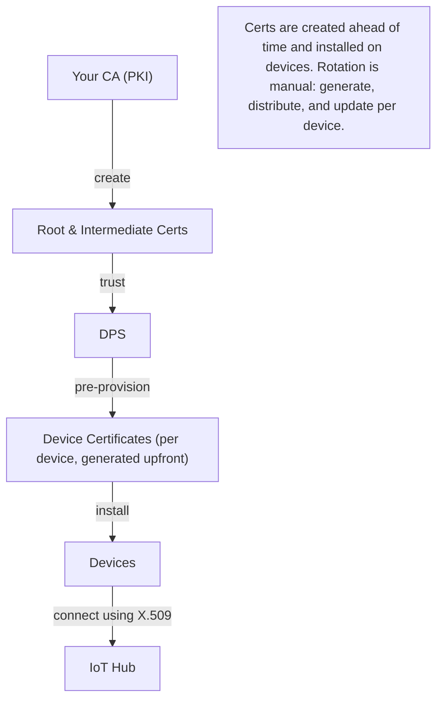

```mermaid
graph TD
    CA["Your CA (PKI)"] -->|create| Certs["Root & Intermediate Certs"]
    Certs -->|trust| DPS["DPS"]
    DPS -->|pre-provision| DeviceCerts["Device Certificates (per device, generated upfront)"]
    DeviceCerts -->|install| Devices["Devices"]
    Devices -->|connect using X.509| Hub["IoT Hub"]

    Notes["Certs are created ahead of time and installed on devices. Rotation is manual: generate, distribute, and update per device."]
```
